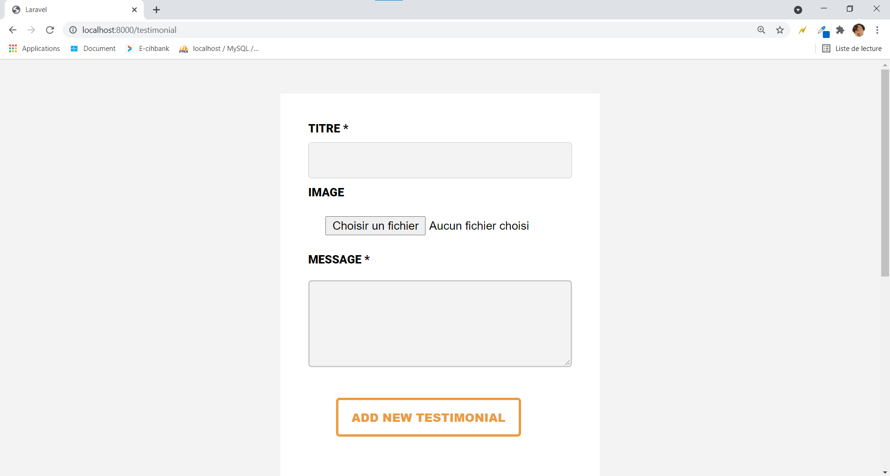

# Testimonials module with laravel 

## Usage

```
git clone https://github.com/lamyita/testimonial_laravel_test.git
```

Then put the project in your webserver root directory `laragon\www` for laragon or `xampp\htdocs` for xampp

- Run your server :

   `php artisan serve`.
   
- Make Database Connection :

To establish the database connection with laravel framework, modify the .env file and put the database credentials such as the port, the username and the password.

```
DB_CONNECTION=mysql
DB_HOST=127.0.0.1
DB_PORT=3306
DB_DATABASE=egiotestimoniallaravel
DB_USERNAME=root
DB_PASSWORD= 
```


to migrate the database run this following command 
 `php artisan migrate`
 
- Run your application :

  URL:  `http://localhost:8000/testimonial`.


## How to test :

<h1>FORM </h1>



